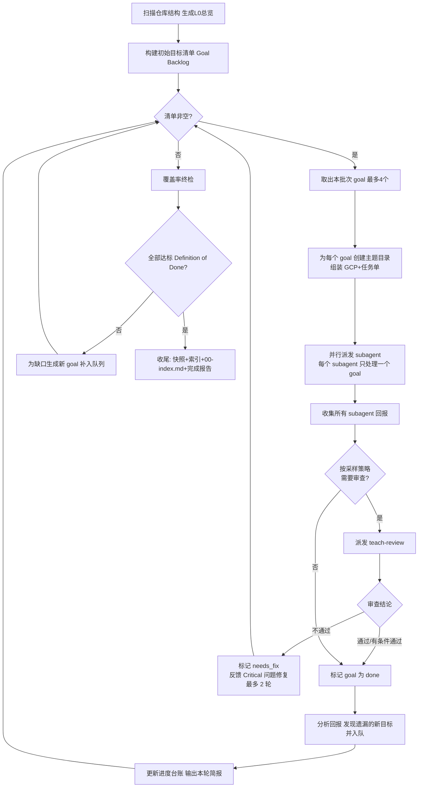

# Goal Loop 算法

自主驱动教学文档生成的完整算法。核心思想：不断从目标清单取出下一个学习目标 → 收集上下文 → 派发 subagent 调用 teach SKILL 生成文档 → 审查产出 → 标记完成并发现新目标 → 循环，直到清单清空且覆盖率校验全部通过。

## 目录

- [流程图](#流程图)
- [优先级规则](#优先级规则)
- [伪代码](#伪代码)
- [Goal 数据结构](#goal-数据结构)
- [并行调度规则](#并行调度规则)
- [Agent Team 调度模型](#agent-team-调度模型)
- [异常处理](#异常处理)
- [全局上下文包（GCP）](#全局上下文包gcp)

## 流程图



## 优先级规则

同一层内广度优先，跨层严格顺序：

| 优先级 | 层级 | 说明 |
|--------|------|------|
| 1 | L0 | 唯一，最先执行，通过审查后才可派发 L1 |
| 2 | L1 | 全部模块总览，逐个覆盖，不遗漏任何顶层目录 |
| 3 | L2 | 按核心程度排序，先主干功能（登录、核心业务流程），再边缘/后台管理功能 |
| 4 | L3 | 优先补全 L2 文档中已提及但尚未展开的函数/类；跑完一轮后做文件差集扫描 |
| 5 | L4 | 当 L3 发现高复杂度函数时动态生成，随时入队随时派发 |

## 伪代码

```
初始化:
    file_tree = 扫描目标仓库，得到完整文件清单（排除 vendor/自动生成/二进制）
    goal_queue = [ L0 总览 goal ]
    done = {}
    progress = 在 teach/<project>/ 下新建 _progress.json / _progress.md

while goal_queue 非空:
    batch = 取出优先级最高且 depends_on 全部满足的最多 {MAX_PARALLEL_AGENTS} 个 goal

    # 主 Agent（编排器）为每个 goal 做派发前准备
    # 每个 goal = 1 个 subagent，绝不合并
    for goal in batch:
        若 goal 的主题目录不存在: 运行 init_topic.sh 创建（L3 复用父 L1 的目录，跳过）
        gcp = 生成全局上下文包（模板见 task-order.md）
        task_order = 按标准任务单格式填充（见 task-order.md）
        prompt = gcp + task_order

    并行启动 subagent(goal, prompt) for goal in batch

    # 主 Agent 收集所有 subagent 回报
    for goal in batch:
        result = 等待 subagent 完成或超时
        若失败:
            goal.retry_count += 1
            若 goal.retry_count < 3: goal.status = "pending"（下轮重试）
            否则: goal.status = "blocked"（告警，留待人工介入）
            continue

        记录产出路径、产出摘要

        # 审查（采样策略见 agent/teach-review.md：L3 每 5 个审 1 个，其余全审）
        若 goal 需要审查:
            review_result = 派发 teach-review subagent(goal, output_path, GCP)
            goal.review_round += 1
            若 review_result == "通过":
                goal.review_status = "passed"; 标记 done
            若 review_result == "有条件通过":
                goal.review_status = "conditional_pass"
                Important 问题记录到 goal.review_issues; 标记 done
            若 review_result == "不通过":
                goal.review_status = "failed"
                若 goal.review_round <= 2:
                    goal.status = "needs_fix"
                    （将 Critical 问题反馈给 teach subagent，下轮修复后重审）
                否则: goal.status = "blocked"
        否则:
            goal.review_status = "skipped"; 标记 done

        new_goals = 从 result 中提取新发现的模块/函数/依赖
        goal_queue.extend(去重后的 new_goals)

    更新 progress（含 completed_at 时间戳）
    输出本轮简报: 完成了什么 / 新发现了什么 / 当前总体进度百分比

    每完成一个 L1 模块的所有子目标后:
        diff = file_tree - 已被引用/讲解过的文件
        若 diff 非空: 为 diff 中每个文件生成对应 L3 补充 goal 并入队

终止条件:
    goal_queue 为空 且 Definition of Done 全部达成（见 coverage-checklist.md）
    → 执行收尾流程（生成快照、补全 index.md、生成 00-index.md、输出完成报告）
    → 如有 blocked goal，单独列出并说明原因

若 goal_queue 为空但 DoD 未全部达成:
    → 扫描缺口，为每个缺口生成补充 goal 并入队，继续循环
```

## Goal 数据结构

每个目标在 `_progress.json` 中的标准记录：

```json
{
  "id": "L2-auth-login-flow",
  "level": "L2_vertical_slice",
  "title": "用户登录鉴权全链路",
  "parent": "L1-auth-module",
  "status": "pending",
  "depends_on": ["L1-auth-module"],
  "sources": [
    "src/routes/auth.ts:12-88",
    "src/middleware/authGuard.ts",
    "src/services/authService.ts",
    "src/repositories/userRepository.ts"
  ],
  "discovered_from": "L1-auth-module",
  "output_path": "teach/<project>/slice-auth-login-flow/lessons/auth-login-flow.html",
  "new_goals_found": [],
  "retry_count": 0,
  "completed_at": null,
  "review_status": "pending",
  "review_issues": {
    "critical": [],
    "important": [],
    "minor": []
  },
  "review_round": 0
}
```

**字段说明**：

| 字段 | 说明 |
|------|------|
| `id` | 唯一标识，格式 `{层级}-{模块/功能-slug}` |
| `level` | `L0_project` / `L1_module` / `L2_vertical_slice` / `L3_micro` / `L4_deep_dive` |
| `title` | 中文简短标题 |
| `parent` | 父 goal 的 id，L0 为 null |
| `status` | `pending` / `in_progress` / `needs_fix` / `done` / `failed` / `blocked` |
| `depends_on` | 必须在这些 goal 完成后才能开始 |
| `sources` | 涉及的源码文件路径（可含行号范围） |
| `discovered_from` | 从哪个 goal 的分析中发现此目标 |
| `output_path` | 产出文件路径 |
| `new_goals_found` | 本轮完成后发现的新目标 id 列表 |
| `retry_count` | subagent 失败重试次数，默认 0，达到 3 次标记为 blocked |
| `completed_at` | 完成时间（ISO 8601），用于 GCP"最近完成"排序，未完成为 null |
| `review_status` | `pending` / `passed` / `conditional_pass` / `failed` / `skipped` |
| `review_issues` | 审查发现的问题，按严重程度（critical/important/minor）分组 |
| `review_round` | 已执行的审查轮次，默认 0，超过 2 轮仍不通过标记 blocked |

**status 状态机**：

```
pending → in_progress → done                     （审查通过 / 跳过审查）
                      ↘ needs_fix → in_progress  （Critical 修复，最多 2 轮审查）
                      ↘ failed → pending          （重试，最多 3 次）
                                ↘ blocked         （重试/修复耗尽，留待人工）
```

## 并行调度规则

**MAX_PARALLEL_AGENTS = 4**，全自动批量模式下保持此值不变。

- 4 是 subagent 的并行上限，不是 goal 的合并数。每个 subagent 只处理一个 goal。满足依赖条件的 goal 不足 4 个时，派发实际可用的数量，不强行凑数。
- **teach-review 也计入并行上限。** 建议每轮派发 3 个 teach goal + 预留 1 个槽位给 review，或采用交替派发策略（先派发 teach 批次 → 等待完成 → 再派发 review 批次）。

**并行 vs 串行判断**：

- **可并行**：goal A 和 goal B 的 `depends_on` 全部满足（依赖的 goal 均已 `done`），且 A 和 B 之间无相互依赖
- **必须串行**：goal B 的 `depends_on` 包含 goal A，则 B 必须等 A 完成后才能派发
- L0 天然串行（唯一且被所有 goal 依赖），L0 通过审查后才可派发 L1
- L1 模块之间通常无依赖，可大批量并行
- 同一模块的 L2 依赖对应 L1；L3 依赖对应 L1（及其引用来源的 L2）；同一模块下的多个 L2 / 多个 L3 可并行
- L4 触发时机不定，随时入队随时派发

## Agent Team 调度模型

### 角色分工

| 角色 | 职责 | 禁止行为 |
|------|------|---------|
| **主 Agent（编排器）** | Goal Loop 循环控制、创建主题目录、进度台账更新、覆盖率校验、新 goal 发现、派发 teach-review | 不直接调用 teach SKILL、不直接读取源码生成文档 |
| **Teach Subagent（执行器）** | 读取源码、调用 teach SKILL 生成文档、写入产出文件、回报结果 | 不修改进度台账、不修改 goal_queue、不越权做覆盖率判断 |
| **Teach-Review Subagent（审查员）** | 对照教学规范审查产出质量、验证技术事实与源码一致性、返回审查报告 | 不修改产出文件、不修改进度台账、不生成新内容 |

### 调度流程

```
主 Agent                           Teach Subagent(s)        Teach-Review Subagent
  │                                      │                        │
  ├─ 取出批次 goal ──────────────────────│                        │
  ├─ 创建主题目录（init_topic.sh）       │                        │
  ├─ 为每个 goal 组装 GCP + 任务单       │                        │
  ├─ runSubagent(goal) ─────────────────→├─ 读取源码              │
  │                                      ├─ 调用 teach SKILL      │
  │                                      ├─ 写入产出              │
  │                                      ├─ 回报结果              │
  ├─ 收集回报 ←──────────────────────────│                        │
  │                                      │                        │
  ├─ runSubagent(review) ────────────────────────────────────────→├─ 读取产出文档
  │                                                                ├─ 对照源码验证
  │                                                                ├─ 审查教学规范
  │                                                                ├─ 返回审查报告
  ├─ 收集审查报告 ←────────────────────────────────────────────────│
  │                                      │                        │
  ├─ 根据审查结论更新 goal 状态          │                        │
  ├─ 发现新 goal、更新进度台账           │                        │
  ├─ 输出本轮简报                        │                        │
  │                                      │                        │
  └─ 循环 ───────────────────────────────│                        │
```

审查的派发时机、采样策略、修复循环细节见 [../agent/teach-review.md](../agent/teach-review.md)。

## 异常处理

- subagent 超时或失败 → 标记 goal 为 `failed`，下一轮循环重试（`retry_count` 累计，最多 3 次）
- 3 次重试仍失败 → 标记为 `blocked`，输出告警，继续处理其他 goal
- 审查 2 轮仍有 Critical 问题 → 标记为 `blocked`
- blocked goal 不阻塞循环，在最终报告中单独列出，由人工介入

## 全局上下文包（GCP）

每次派发 subagent（含 teach-review）时，主 Agent 必须在 prompt 中前置 GCP。这是 subagent 了解项目全局的唯一信息源；subagent 拿到 GCP 中的目录树后，可自主使用 `list_dir`、`read_file` 等工具进一步探查任何已生成文档，无需主 Agent 二次介入。

**GCP 的标准模板与字段填充规则统一定义在 [task-order.md](task-order.md)，此处不重复。**
