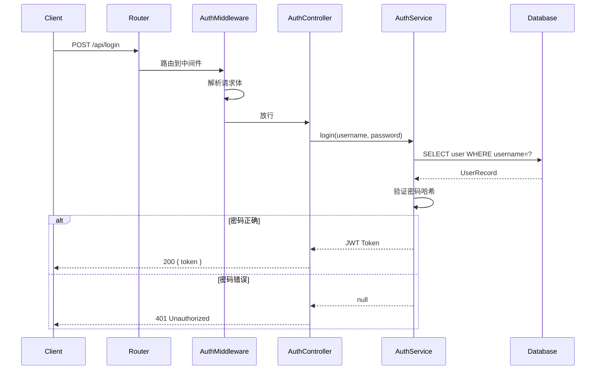

# 垂直切片设计指南

垂直切片是与"按模块横切"互补的视角：模块总览是"竖着看一层楼"，垂直切片是"从一楼电梯直接坐到顶楼，把沿途每一层都摸一遍"。

## 选取标准

优先选择用户 / 调用方能直接感知的完整行为。典型示例：

- 登录鉴权（前端表单 → 路由 → 中间件 → Service → DB → Token 返回）
- 下单支付（购物车 → 订单创建 → 支付网关 → 回调 → 状态更新）
- 文件上传处理（前端选择 → API 接收 → 校验 → 存储 → 元数据入库）
- CLI 命令执行（参数解析 → 配置加载 → 核心逻辑 → 结果输出）
- 事件驱动流程（消息到达 → 反序列化 → 业务处理 → 确认/重试）

## 每个垂直切片主题必须覆盖 5 要素

这些要素不要求塞进同一节课。复杂链路必须拆成同一 `slice-*` 主题下的多节短课。

1. **入口点**：HTTP 路由 / CLI 命令 / 事件监听 / UI 事件处理等，附真实代码片段
2. **沿途每一层**：中间件 → Controller → Service → Repository/DAO → 外部依赖（DB、缓存、消息队列、第三方 API），每节课只展开少量关键层
3. **调用时序**：mermaid 时序图或 ASCII 时序描述，清晰展示调用链
4. **至少一条异常/边界路径**：如认证失败、参数非法、超时、资源不存在，展示错误如何逐层传播与处理
5. **交叉链接**：与相关 L1 模块总览、L3 API 参考的链接

## 时序图示例

## 命名规范

每个垂直切片是一个独立 teach 主题目录 `slice-<功能-slug>/`，课程文件沿用 `.agents/skills/teach/SKILL.md` 的编号命名。

- `<功能-slug>`：短横线命名的功能英文简述（如 `auth-login-flow`、`order-checkout-flow`）
- 简单切片至少生成 `lessons/0001-flow-map.html`
- 复杂切片拆成 `lessons/0001-flow-map.html`、`lessons/0002-main-path.html`、`lessons/0003-error-path.html` 等多节短课
- 长源码索引、接口列表、状态表放入 `reference/<功能-slug>-flow-map.html`
- 任务单中的 `output_path` 只是主入口，不代表全部交付物

## L2 垂直切片的内容生成

垂直切片作为 teach 主题产出，**subagent 必须 Read 并激活 `.agents/skills/teach/SKILL.md`**，按短课合约生成一组可完成的 HTML 课程。teach-goal 在任务单中提供：
- 垂直切片涉及的所有源码文件及行号
- 层级顺序（如"路由 → 中间件 → Service → DAO → 数据库"）
- 必须覆盖的异常路径
- 关联的 L1/L3 文档路径

如果任务单涉及源码超过 3 个文件或链路超过 4 个阶段，subagent 必须先拆 lesson manifest，再逐节生成短课。
