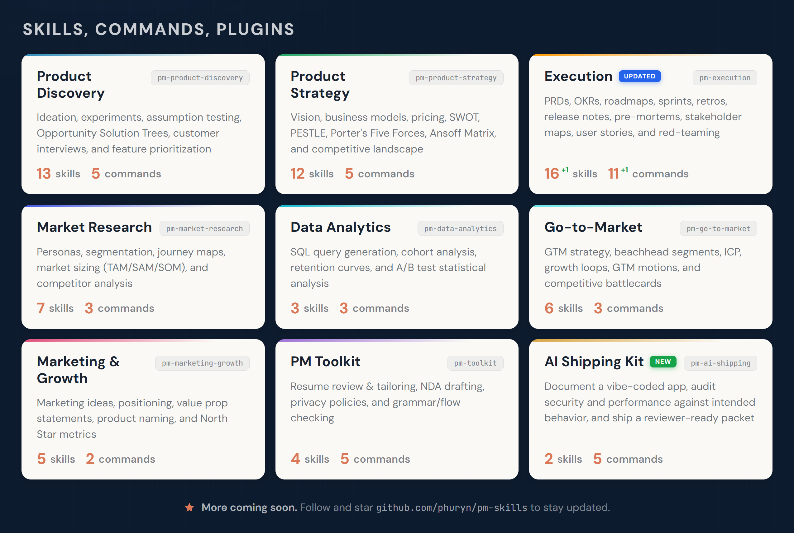
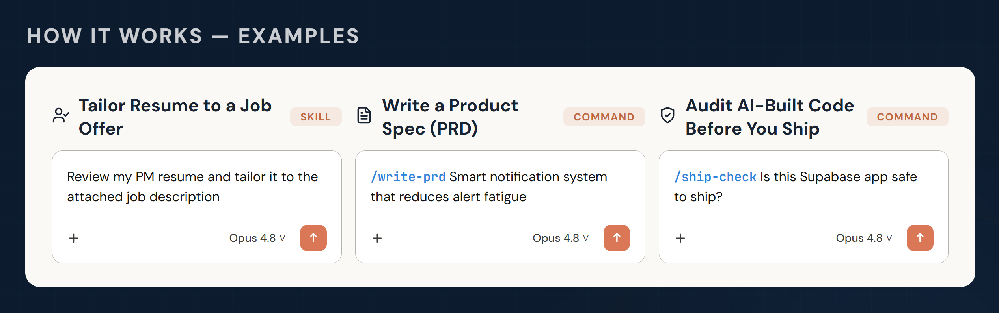

[](https://github.com/phuryn/pm-skills/blob/main/LICENSE)
[](https://github.com/phuryn/pm-skills/blob/main/CONTRIBUTING.md)
[](https://github.com/phuryn/pm-brain)

# PM Skills Marketplace：更好的产品决策的 AI 操作系统

> 跨 9 个插件提供 68 个 PM skills 和 42 个链式 workflows。支持 Claude Code、Cowork 等。覆盖从探索、战略、执行、发布、增长到交付 AI 构建代码的全流程。



为 Claude Code 和 Cowork 设计。Skills 兼容其他 AI 助手。

## 快速入门

新想法？→ `/discover`
需要战略清晰度？→ `/strategy`
撰写 PRD？→ `/write-prd`
规划发布？→ `/plan-launch`
定义指标？→ `/north-star`

如果这个项目对你有帮助，请 ⭐ 这个仓库。

## 为什么选择 PM Skills Marketplace？

通用 AI 给你文本。PM Skills Marketplace 给你结构。

每个 skill 编码了一个经过验证的 PM 框架——发现、假设映射、优先级排序、战略——并逐步引导你完成。你将 Teresa Torres、Marty Cagan 和 Alberto Savoia 的严谨方法论融入日常工作流中，而不是放在书架上落灰。

结果：更好的产品决策，而不仅仅是更快的文档产出。

## 如何工作（Skills、Commands、Plugins）



**Skills** 是市场的基础构建块。每个 skill 为 Claude 提供领域知识、分析框架或针对特定 PM 任务的引导式工作流。部分 skills 还能作为多个 commands 共享的可复用基础。

Skills 在与对话相关时自动加载——无需显式调用。如有需要（例如让 skills 优先于通用知识），你可以通过 `/plugin-name:skill-name` 或 `/skill-name` **强制加载 skills**（Claude 将添加前缀）。

**Commands** 是通过 `/command-name` 触发的用户驱动工作流。它们将一个或多个 skills 串联为端到端流程。例如，`/discover` 将四个 skills 串联在一起：brainstorm-ideas → identify-assumptions → prioritize-assumptions → brainstorm-experiments。

**Plugins** 将相关的 skills 和 commands 组织为可安装的包。每个插件覆盖一个 PM 领域——发现、战略、执行等。安装市场可一次性获取全部 9 个插件。

Commands 使用 skills。一些 skills 服务于多个 commands。一些 skills（如 `prioritization-frameworks` 或 `opportunity-solution-tree`）是独立参考，Claude 在任何相关时即可调用——无需 command。

Commands 设计为可相互衔接，匹配 PM 工作流。每个 command 完成后，会建议相关的下一步 commands——只需跟随提示即可。

## 安装

### Claude Cowork（推荐非开发者使用）

1. 打开 **Customize**（左下角）
2. 前往 **Browse plugins** → **Personal** → **+**
3. 选择 **Add marketplace from GitHub**
4. 输入：`phuryn/pm-skills`

全部 9 个插件自动安装。你同时获得 commands（`/discover`、`/strategy` 等）和 skills。


### Claude Code（CLI）

```bash
# 第 1 步：添加市场
claude plugin marketplace add phuryn/pm-skills

# 第 2 步：安装各插件
claude plugin install pm-toolkit@pm-skills
claude plugin install pm-product-strategy@pm-skills
claude plugin install pm-product-discovery@pm-skills 
claude plugin install pm-market-research@pm-skills 
claude plugin install pm-data-analytics@pm-skills
claude plugin install pm-marketing-growth@pm-skills
claude plugin install pm-go-to-market@pm-skills
claude plugin install pm-execution@pm-skills
claude plugin install pm-ai-shipping@pm-skills
```

### Codex CLI（OpenAI）

Codex 读取与 Claude Code 相同的插件市场文件，因此你可以原生安装 PM Skills——无需转换或复制文件：

```bash
# 第 1 步：添加市场
codex plugin marketplace add phuryn/pm-skills

# 第 2 步：安装你需要的插件
codex plugin add pm-toolkit@pm-skills
codex plugin add pm-product-strategy@pm-skills
codex plugin add pm-product-discovery@pm-skills
codex plugin add pm-market-research@pm-skills
codex plugin add pm-data-analytics@pm-skills
codex plugin add pm-marketing-growth@pm-skills
codex plugin add pm-go-to-market@pm-skills
codex plugin add pm-execution@pm-skills
codex plugin add pm-ai-shipping@pm-skills
```

**你能获得什么：**每个 skill（PM 框架），可供 Codex 使用并按名称调用。安装完整插件而非挑选单个 skills——一个工作流通常依赖多个一同发布的 skills。

**与 Claude Code 的不同之处：**`/slash` 命令（`/discover`、`/write-prd` 等）已安装但不会作为 Codex slash 命令运行——Codex 插件不暴露 commands。要运行工作流，只需用自然语言描述步骤，例如：

> 对*[你的想法]*运行 product discovery：头脑风暴选项、映射假设、对高风险的进行优先级排序，然后设计实验——在各步骤之间暂停。

**可选——让 Codex 将工作流转化为 skills。**由于 command 文件随每个已安装插件一同发布，你可以让 Codex 转换你最常用的工作流：

> 读取 pm-execution 插件中的 command 文件，并为我最常用的工作流创建等效的 Codex skills。

这是基于模型驱动的最佳努力的转换（一些 Claude 特定的 command 语法无法转换），但这是在 CLI 中快速在 Codex 上获得引导式工作流的方式。

### 其他 AI 助手（仅 skills）

`skills/*/SKILL.md` 文件遵循通用 skill 格式，可与任何读取该格式的工具配合使用。Commands（`/slash-commands`）是 Claude 特有的。

| 工具 | 如何使用 | 可用的内容 |
|------|-----------|------------|
| **Gemini CLI** | 将 skill 文件夹复制到 `.gemini/skills/` | 仅 Skills |
| **OpenCode** | 将 skill 文件夹复制到 `.opencode/skills/` | 仅 Skills |
| **Cursor** | 将 skill 文件夹复制到 `.cursor/skills/` | 仅 Skills |
| **Kiro** | 将 skill 文件夹复制到 `.kiro/skills/` | 仅 Skills |

```bash
# 示例：为 OpenCode 复制所有 skills（项目级别）
for plugin in pm-*/; do
  mkdir -p .opencode/skills/
  cp -r "$plugin/skills/"* .opencode/skills/ 2>/dev/null
done

# 示例：为 Gemini CLI 复制所有 skills（全局）
for plugin in pm-*/; do
  cp -r "$plugin/skills/"* ~/.gemini/skills/ 2>/dev/null
done
```

---

## 可用插件

<details>
<summary><strong>1. pm-product-discovery</strong> — 创意构思、实验、假设验证、OST、访谈（13 个 skills、5 个 commands）</summary>

**Skills（13 个）：**

- `brainstorm-ideas-existing` — 已有产品的多角度创意构思（PM、设计师、工程师）
- `brainstorm-ideas-new` — 初期发现中的新产品创意构思
- `brainstorm-experiments-existing` — 为已有产品设计实验以验证假设
- `brainstorm-experiments-new` — 为新产品设计精益创业原型测试（Alberto Savoia）
- `identify-assumptions-existing` — 跨价值、可用性、可行性和可实现性识别高风险假设
- `identify-assumptions-new` — 跨 8 个风险类别（包括上市策略、战略和团队）识别高风险假设
- `prioritize-assumptions` — 使用影响 × 风险矩阵对假设进行优先级排序，并附实验建议
- `prioritize-features` — 基于影响、工作量、风险和战略对齐度对功能待办列表进行优先级排序
- `analyze-feature-requests` — 按主题和战略匹配度分析和分类客户功能请求
- `opportunity-solution-tree` — 构建机会解决方案树（Teresa Torres）——成果 → 机会 → 解决方案 → 实验
- `interview-script` — 创建包含 JTBD 探究问题的结构化客户访谈脚本
- `summarize-interview` — 将访谈记录总结为 JTBD、满意度信号和行动项
- `metrics-dashboard` — 设计包含北极星指标、输入指标和告警阈值的产品指标仪表盘

**Commands（5 个）：**

- `/discover` — 完整发现流程：创意构思 → 假设映射 → 优先级排序 → 实验设计
- `/brainstorm` — 多角度创意构思（`ideas|experiments` × `existing|new`）
- `/triage-requests` — 分析和排序一批功能请求
- `/interview` — 准备访谈脚本或总结访谈记录（`prep|summarize`）
- `/setup-metrics` — 设计产品指标仪表盘

**示例：**

Skills：
- `我们的 AI 写作助手创意最危险的假设是什么？`
- `帮我为提升用户激活构建一个机会解决方案树`
- `对来自企业客户的这 12 个功能请求进行优先级排序 [附 CSV]`

Commands：
- `/discover 面向远程团队的 AI 驱动的会议摘要工具`
- `/brainstorm experiments existing — 我们需要降低引导流程的流失率`
- `/interview prep — 我们正在与企业采购方就他们的采购工作流进行访谈`

</details>

<details>
<summary><strong>2. pm-product-strategy</strong> — 愿景、商业模式、定价、竞争格局（12 个 skills、5 个 commands）</summary>

产品战略、愿景、商业模式、定价和宏观环境分析。覆盖从愿景构思到竞争格局扫描的完整战略工具箱。

**Skills（12 个）：** `product-strategy`、`startup-canvas`、`product-vision`、`value-proposition`、`lean-canvas`、`business-model`、`monetization-strategy`、`pricing-strategy`、`swot-analysis`、`pestle-analysis`、`porters-five-forces`、`ansoff-matrix`

**Commands（5 个）：** `/strategy`、`/business-model`、`/value-proposition`、`/market-scan`、`/pricing`

**示例：**
- Skills：`比较精益画布 vs 商业模式画布 vs 初创画布对我的市场平台初创企业的适用性`
- Commands：`/strategy 面向代理商的 B2B 项目管理工具`

</details>

<details>
<summary><strong>3. pm-execution</strong> — PRD、OKR、路线图、Sprint、回顾、发布说明、利益相关方管理（16 个 skills、11 个 commands）</summary>

日常产品管理：PRD、OKR、路线图、Sprint、回顾、发布说明、事前验尸、利益相关方管理、用户故事和优先级框架。

**Skills（16 个）：** `create-prd`、`brainstorm-okrs`、`outcome-roadmap`、`sprint-plan`、`retro`、`release-notes`、`pre-mortem`、`stakeholder-map`、`summarize-meeting`、`user-stories`、`job-stories`、`wwas`、`test-scenarios`、`dummy-dataset`、`prioritization-frameworks`、`strategy-red-team`

**Commands（11 个）：** `/write-prd`、`/plan-okrs`、`/transform-roadmap`、`/sprint`、`/pre-mortem`、`/red-team-prd`、`/meeting-notes`、`/stakeholder-map`、`/write-stories`、`/test-scenarios`、`/generate-data`

</details>

<details>
<summary><strong>4. pm-market-research</strong> — 用户画像、细分、旅程地图、市场规模、竞争对手分析（7 个 skills、3 个 commands）</summary>

用户研究和竞争分析：用户画像、细分、旅程地图、市场规模、竞争对手分析和反馈分析。

**Skills（7 个）：** `user-personas`、`market-segments`、`user-segmentation`、`customer-journey-map`、`market-sizing`、`competitor-analysis`、`sentiment-analysis`

**Commands（3 个）：** `/research-users`、`/competitive-analysis`、`/analyze-feedback`

</details>

<details>
<summary><strong>5. pm-data-analytics</strong> — SQL 生成、同期群分析、A/B 测试分析（3 个 skills、3 个 commands）</summary>

面向 PM 的数据分析：SQL 查询生成、同期群分析和 A/B 测试分析。

**Skills（3 个）：** `sql-queries`、`cohort-analysis`、`ab-test-analysis`

**Commands（3 个）：** `/write-query`、`/analyze-cohorts`、`/analyze-test`

</details>

<details>
<summary><strong>6. pm-go-to-market</strong> — 滩头阵地细分、ICP、信息传递、增长循环、GTM 模式、竞争对比卡（6 个 skills、3 个 commands）</summary>

产品上市策略：滩头阵地细分、理想客户画像、信息传递、增长循环、GTM 模式和竞争对比卡。

**Skills（6 个）：** `gtm-strategy`、`beachhead-segment`、`ideal-customer-profile`、`growth-loops`、`gtm-motions`、`competitive-battlecard`

**Commands（3 个）：** `/plan-launch`、`/growth-strategy`、`/battlecard`

</details>

<details>
<summary><strong>7. pm-marketing-growth</strong> — 营销创意、定位、价值主张、命名、北极星指标（5 个 skills、2 个 commands）</summary>

产品营销与增长：营销创意、定位、价值主张陈述、产品命名和北极星指标。

**Skills（5 个）：** `marketing-ideas`、`positioning-ideas`、`value-prop-statements`、`product-name`、`north-star-metric`

**Commands（2 个）：** `/market-product`、`/north-star`

</details>

<details>
<summary><strong>8. pm-toolkit</strong> — 简历审核、法律文件、校对（4 个 skills、5 个 commands）</summary>

核心产品工作之外的 PM 实用工具：简历审核、法律文件和校对。

**Skills（4 个）：** `review-resume`、`draft-nda`、`privacy-policy`、`grammar-check`

**Commands（5 个）：** `/review-resume`、`/tailor-resume`、`/draft-nda`、`/privacy-policy`、`/proofread`

</details>

<details>
<summary><strong>9. pm-ai-shipping</strong> — AI 交付套件：为 vibe-coded 应用编写文档、审计安全性和性能、映射测试覆盖、编制交付包（2 个 skills、5 个 commands）</summary>

面向对 AI 构建代码负责的 PM 和创业者。AI 代理快速编写代码，但不会留下*意图*记录——系统应该做什么、谁可以做什么、密钥存放在哪里、哪些规则真正得到了验证。本套件恢复了可审查性：它先为系统编写文档，然后审计文档所述与代码实际行为之间的差距——这是通用扫描器无法发现的一类 bug。

**Skills（2 个）：** `shipping-artifacts`、`intended-vs-implemented`

**Commands（5 个）：** `/ship-check`、`/document-app`、`/derive-tests`、`/security-audit-static`、`/performance-audit-static`

</details>

---

## 关于

本市场随产品实践和 AI 能力的演进而不断进化。

精选 skills 基于以下作者的工作：

- Teresa Torres — [*Continuous Discovery Habits*](https://www.amazon.com/Continuous-Discovery-Habits-Discover-Products/dp/1736633309/)
- Marty Cagan — [*INSPIRED*](https://www.amazon.com/INSPIRED-Create-Tech-Products-Customers/dp/1119387507/) 和 [*TRANSFORMED*](https://www.amazon.com/dp/1119697336/)
- Alberto Savoia — [*The Right It*](https://www.amazon.com/Right-Many-Ideas-Yours-Succeed/dp/0062884654)
- Dan Olsen — [*The Lean Product Playbook*](https://www.amazon.com/dp/1118960874/)
- Roger L. Martin — [*Playing to Win*](https://www.amazon.com/Playing-Win-Expanded-Bonus-Articles/dp/B0F25SDYWV/)
- Ash Maurya — [*Running Lean*](https://www.amazon.com/dp/B004J4XGN6/)
- Strategyzer — [*Business Model Generation*](https://www.amazon.com/dp/0470876417/) 和 [*Value Proposition Design*](https://www.amazon.com/dp/1118968050/)
- Christina Wodtke — [*Radical Focus*](https://www.amazon.com/Radical-Focus-Achieving-Important-Objectives/dp/0996006052)
- Anthony W. Ulwick — [*Jobs to Be Done*](https://jobs-to-be-done-book.com/)
- Alistair Croll & Benjamin Yoskovitz — [*Lean Analytics*](https://www.amazon.com/Lean-Analytics-Better-Startup-Faster/dp/1449335675/)
- Sean Ellis — [*Hacking Growth*](https://www.amazon.com/Hacking-Growth-Fastest-Growing-Companies-Breakout/dp/045149721X/)
- Maja Voje — [*Go-To-Market Strategist*](https://gtmstrategist.com/)

由 [The Product Compass Newsletter](https://www.productcompass.pm) 的 Paweł Huryn 策划。

## 与 PM Brain 组合使用


[PM Brain](https://github.com/phuryn/pm-brain) 是产品经理的第二大脑。你笔记本上一个文件夹中的纯 markdown 文件。Claude 在回答前读取它们，回答后写入，每周五进行整理。无需向量数据库、无需云端、无需代理记忆技巧。

## 贡献

参见 [CONTRIBUTING.md](CONTRIBUTING.md)。

## Windows 已知问题

如果你的 Cowork 不稳定且无法启动 VM（[claude-code/issues/27010](https://github.com/anthropics/claude-code/issues/27010)），尝试：

```powershell
$action = New-ScheduledTaskAction -Execute "powershell.exe" -Argument "-WindowStyle Hidden -Command `"if ((Get-Service CoworkVMService).Status -ne 'Running') { Start-Service CoworkVMService }`""

$trigger = New-ScheduledTaskTrigger -RepetitionInterval (New-TimeSpan -Minutes 1) -Once -At (Get-Date)

$settings = New-ScheduledTaskSettingsSet -AllowStartIfOnBatteries -DontStopIfGoingOnBatteries

Register-ScheduledTask -TaskName "CoworkVMServiceMonitor" `
  -Action $action `
  -Trigger $trigger `
  -Settings $settings `
  -RunLevel Highest `
  -User "SYSTEM"
```

这能解决 Windows 上 90% 的问题。
剩余 10%：打开 services.msc > 手动启动 "Claude" 服务

## 许可证

MIT — 参见 [LICENSE](LICENSE)。
